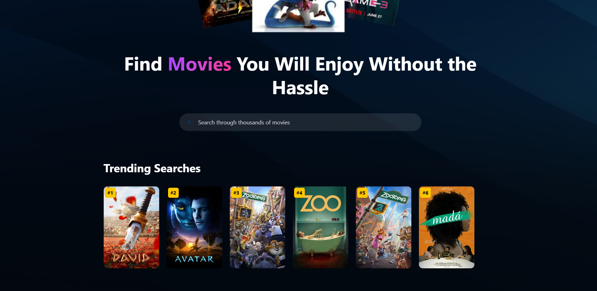
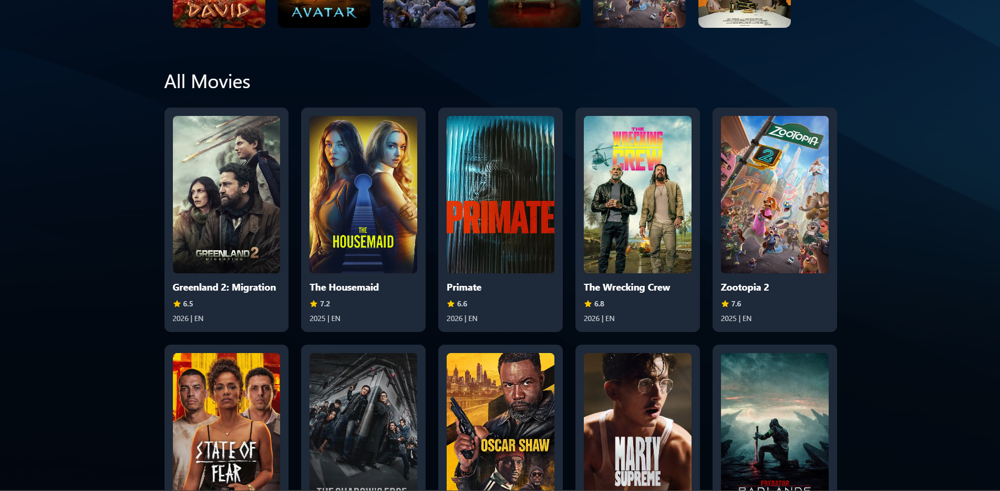
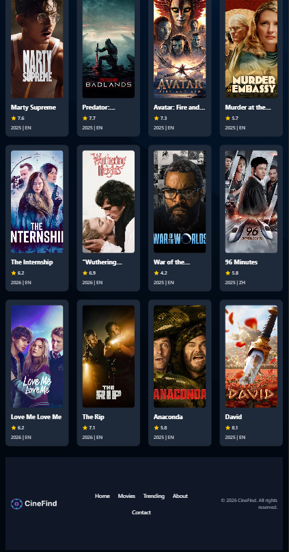

# 🎬 CineFind App – React + Tailwind + Appwrite

🌐 **Live Demo:** [https://glittering-chimera-6b2411.netlify.app/)

CineFind is a modern, responsive web app for discovering movies, tracking trending searches, and viewing movie details with a clean UI. Built with React, Tailwind CSS, and Appwrite for backend tracking, it’s fully responsive across devices.

---

## ✨ Key Features

- **Hero Section:** Eye-catching banner and app logo
- **Search Movies:** Debounced input to avoid excessive API calls
- **Trending Searches:** Tracks popular searches using Appwrite database
- **Movie Cards:** Display poster, title, rating, release year, and language
- **Fallback Images:** Shows a default image if the movie has no poster
- **Loading Spinner:** Smooth UX while fetching data
- **Fully Responsive:** Optimized for mobile, tablet, and desktop
- **Hover Effects:** Subtle scaling for movie cards and trending items

---

## 🛠 Tech Stack

- **Frontend:** React, Tailwind CSS, JavaScript
- **Backend / Database:** Appwrite
- **API:** The Movie Database (TMDB)
- **Deployment:** Netlify
- **Dev Tools:** Vite, VS Code, GitHub

---

## 📸 Screenshots

**Desktop View**  



**Mobile View**  



---

## 🚀 What I Built

- Recreated a **polished, modern movie discovery app** with interactive UI.
- Implemented **debounced search** to reduce unnecessary API requests.
- Integrated **Appwrite** to track trending searches and maintain a backend database.
- Designed **responsive layouts** using Tailwind utilities and Flex/Grid.
- Applied **hover effects** and smooth transitions for a professional feel.

---

## ⚙️ Installation & Usage

1. **Clone the repo**
```bash
git clone https://github.com/abyu301/movie-application
cd moviefinder


npm install


VITE_TMDB_API_KEY=your_tmdb_api_key
VITE_APPWRITE_PROJECT_ID=your_project_id
VITE_APPWRITE_DATABASE_ID=your_database_id
VITE_APPWRITE_TABLE_ID=your_table_id
VITE_APPWRITE_ENDPOINT=your_appwrite_endpoint

npm run dev

npm run build


moviefinder/
│
├── public/                  # Static assets (images, logos)
├── src/
│   ├── components/          # React components (MovieCard, Search, Spinner, Footer)
│   ├── assets/              # Images & icons
│   ├── appwrite.js          # Appwrite database logic
│   ├── App.jsx              # Main app
│   └── main.jsx             # App entry
├── package.json
├── vite.config.js
└── README.md


🏆 Skills Demonstrated

Frontend Development: React component architecture, Tailwind CSS utility-first design

Responsive Design: Mobile-first approach with grid and flex layouts

API Integration: TMDB API for real-time movie data

Backend & Database: Appwrite for storing trending searches

Performance: Debounced search to optimize API calls

UX/UI: Loading spinners, hover effects, responsive hero & cards

❤️ Credits

TMDB API
 for movie data

Appwrite
 for backend database

Tailwind CSS for responsive and modern UI

Netlify for deployment

ChatGPT for AI-assisted development

📜 License

This project is open-source and for educational/portfolio purposes only. Not affiliated with TMDB or Appwrite.
